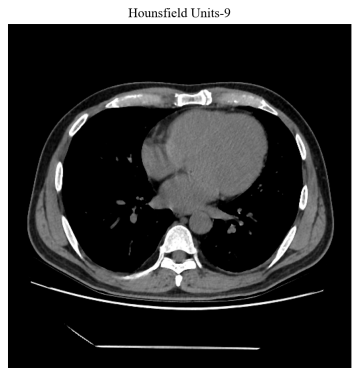
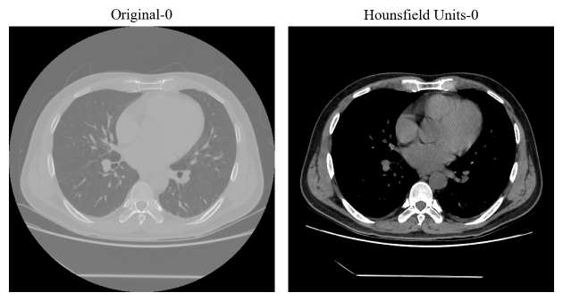

# Radiverse

Radiverse is a Python tool for loading, processing, and visualizing medical DICOM (Digital Imaging and Communications in Medicine) image data with windowing, conversion to Hounsfield units, and saving capabilities.

## Usage Example

```python
from radiverse.utils import Dicom
```

### Load DICOM files

```python
# Single image
dcm = Dicom("ct_files/00000001.dcm")

# Folder
dcm = Dicom("ct_files")
```

output:
```
PatientName: Anonymous
PatientID: 20240527-224912
PatientSex: M
StudyID: 1706
Rows: 512
Columns: 512
SliceThickness: 1.250000
PixelSpacing: [0.703125, 0.703125]
WindowCenter: 60
WindowWidth: 350
RescaleIntercept: -1024
RescaleSlope: 1
```

## Apply windowing

Common (window width, window center) examples:

* Lung: (1500, -400)
* Head: (80, 40)
* Mediastinum: (400, 60)
* Bone: (1500, 300)

```python
dcm.set_window(400, 60)
```

## Display

### Original image
```python
dcm.show(9, cmap="o")
```


### HU image

```python
dcm.show(9, cmap="h")
```



### Both original and HU images
```python
dcm.show(9, cmap="oh")
```


## Save HU images

* Save single HU image

```python
dcm.save_hu_image(index=0, save_path="output")
```

* Save all HU images

```python
dcm.save_all_hu_images(save_path="output")
```

## Acknowledgments

Special thanks to [3097530495yi](https://aistudio.baidu.com/projectdetail/5351683?channelType=0&channel=0) for providing reference.
